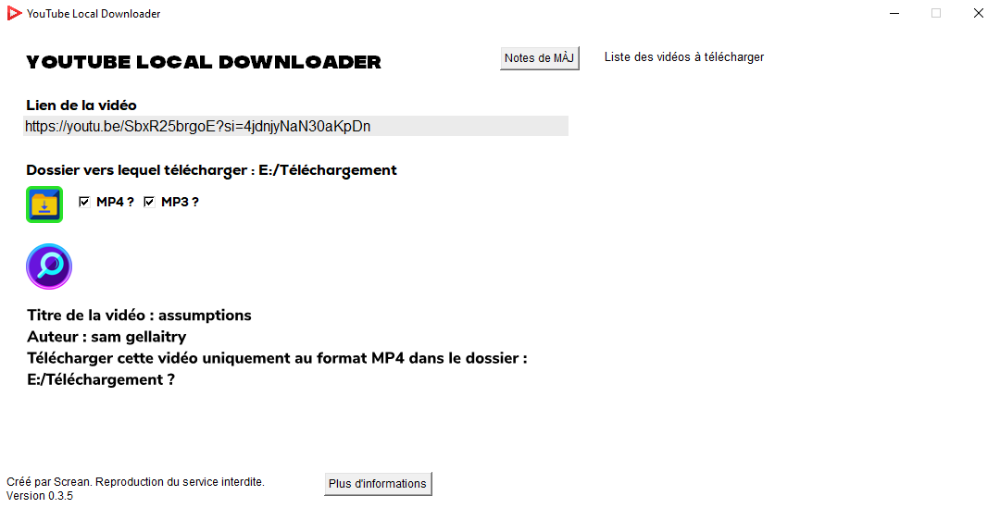
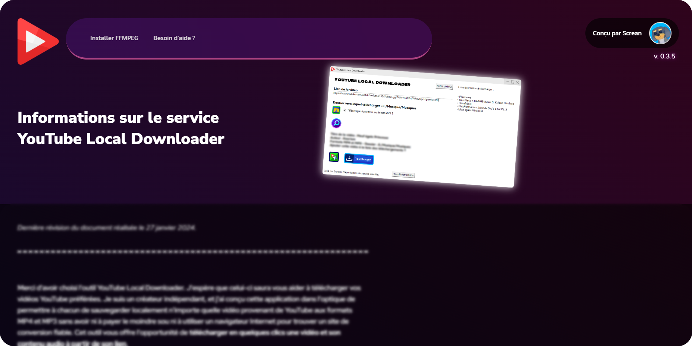
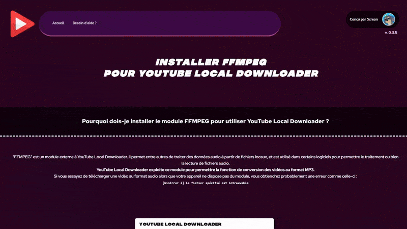

# YouTube Local Downloader : outil de téléchargement de vidéos YouTube

YouTube Local Downloader est un projet personnel visant à concevoir une application de téléchargement de vidéos YouTube aux formats MP4 et MP3.

J'ai majoritairement utilisé le langage Python pour concevoir l'interface graphique. La fonction de téléchargement des vidéos est quant à elle gérée par la librairie PyTube qui exploite l'API de YouTube.

L'application est axée sur la facilité et aide l'utilisateur, par exemple via une page web locale que l'utilisateur peut consulter à partir de l'application pour trouver des aides.

Ce projet d'expérimentation - n'ayant jamais été déployé ni mis à jour - est malheureusement obsolète en raison de modifications réalisées sur l'API. Toutefois, vous pouvez accéder à la page GitHub du projet si vous souhaitez télécharger, essayer et naviguer dans l'application !

### <i class="fa-solid fa-link"></i> Liens annexes

> <a href="https://github.com/ScreanDev/youtube-local-downloader" target="_blank">GitHub du projet</a>