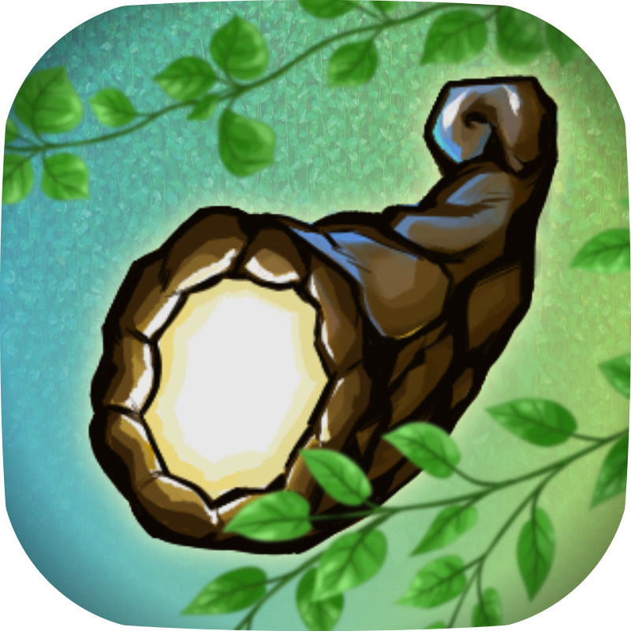
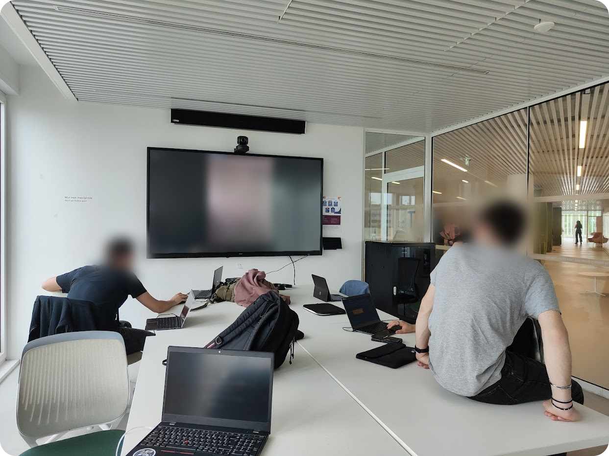

# FrostHorn

FrostHorn is undoubtedly the most important computing project I am currently developing. This project, designed within a team of nine people, aims to create a 2D, pixel art, post-apocalyptic survival game where players must explore, innovate, and fight for resources in a harsh, unforgiving world.

Ce jeu mêle l'aspect créatif, le goût du développement et la coordination en équipe. Nous utilisons <a href="https://github.com/U-Night/FrostHorn" target="_blank">GitHub</a> pour faire évoluer le jeu, avons un serveur Discord dans lequel chacun contribue à l'apport d'idées. Organiser le travail d'équipe ? C'est possible grâce aux outils de <a href="https://www.notion.com/fr" target="_blank">Notion</a>. Enfin, nous organisons mensuellement des réunions physiques dans notre bibliothèque universitaire pour marquer l'avancement du projet et plancher sur les prochaines tâches !

Le projet étant relativement récent, nous n'avons pas encore de prototype complet de jeu, mais nous préparons le terrain. Le jeu utilisera le moteur de jeu **Godot**.

Au stade actuel des choses, nous sommes déjà détenteurs d'un site web statique que nous développons en parallèle : https://wiki.u-night.org, et qui contiendra à l'avenir toute la documentation utile au jeu (en matière d'histoire, d'objets, de fonctionnalités etc.). Pour ce faire, nous utilisons l'outil <a href="https://docusaurus.io" target="_blank">Docusaurus</a>, ainsi que le langage Node.Js. Le lien du projet GitHub et celui du site vous sont fournis en bas de cette page !

Au fait, précisons aussi que je suis chargé du design sonore : je crée les musiques et sons d'ambiance utilisés dans le jeu. Vous pouvez en retrouver des extraits dans mon projet "Musique" ! Je fais aussi partie de l'équipe dédiée à l'histoire, dont j'élabore le script sur le site de la documentation (section <a href="https://wiki.u-night.org/category/game-lore" target="_blank">Game Lore</a>). Enfin, je contribue sur le plan esthétique du jeu et notre image : j'ai notamment conçu les logos utilisés pour notre équipe : U-Night !

### <i class="fa-solid fa-link"></i> Liens annexes

> <a href="https://github.com/U-Night/FrostHorn" target=”_blank”><i class="fa-brands fa-github"></i> GitHub du projet</a>

> <a href="https://github.com/U-Night/wiki" target=”_blank”><i class="fa-solid fa-book"></i> GitHub de la documentation</a>

> <a href="https://wiki.u-night.org" target=”_blank”><i class="fa-solid fa-globe"></i> Site de la documentation</a>
