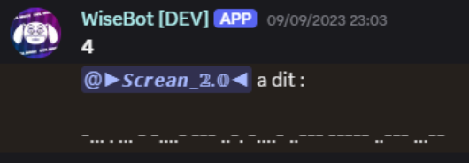

# WiseBot : un bot de divertissement pour Discord

WiseBot est un bot pour Discord : une application interactive que les utilisateurs peuvent utiliser grâce à des <a href="https://discord-france.fr/commandes-slash" target="_blank"><i>commandes slash</i></a>.

J'ai conçu ce projet dans l'optique de déployer un bot axé sur le divertissement. Ainsi, les membres d'un serveur peuvent l'utiliser pour faire des blagues, jouer de la musique, attribuer des rôles, créer des QCM, des sondages, générer un contenu aléatoire, créer des événements... et bien plus !

Le bot est conçu en Python, et utilise la librairie <a href="https://discordpy.readthedocs.io/en/stable/" target="_blank">Discord.py</a> pour interagir avec l'API de Discord. Il utilise également SQLite pour stocker les données des utilisateurs.
Il est également conçu pour être asynchrone, ce qui permet de gérer plusieurs commandes en même temps sans ralentir le serveur Discord.

