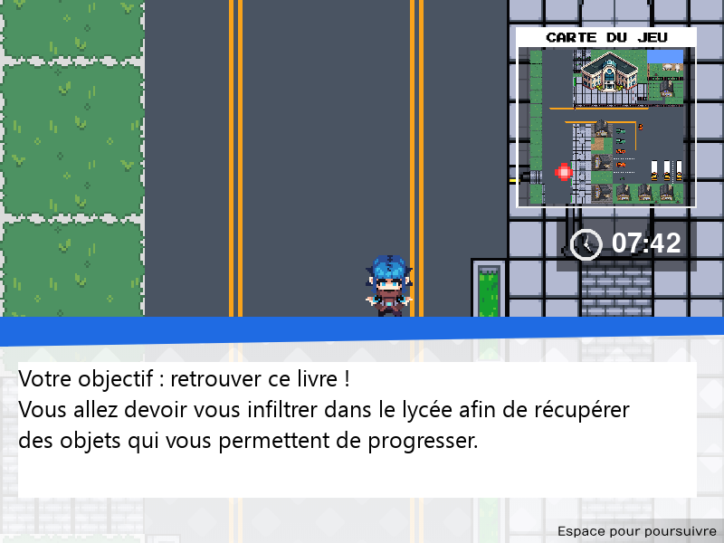
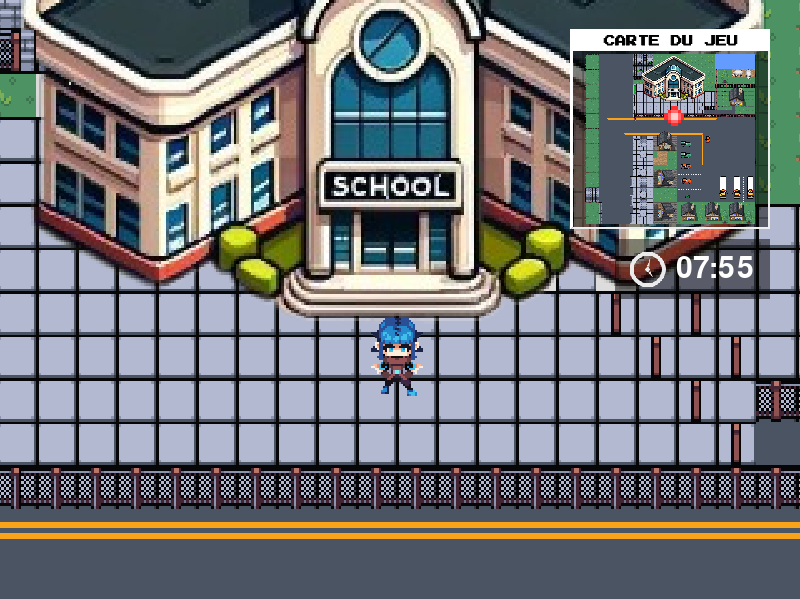
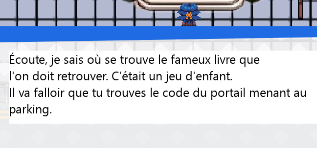
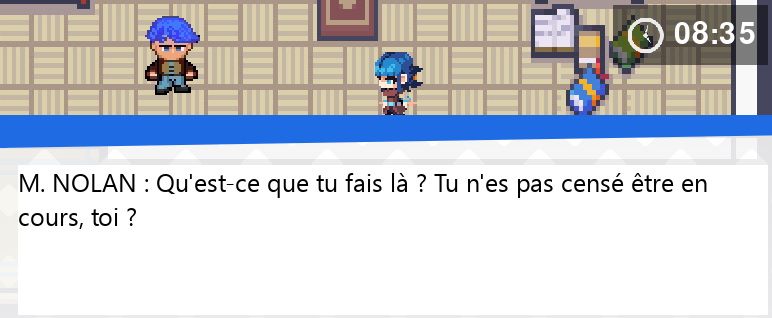
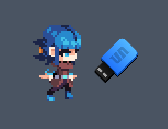
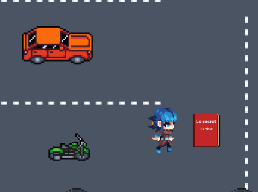
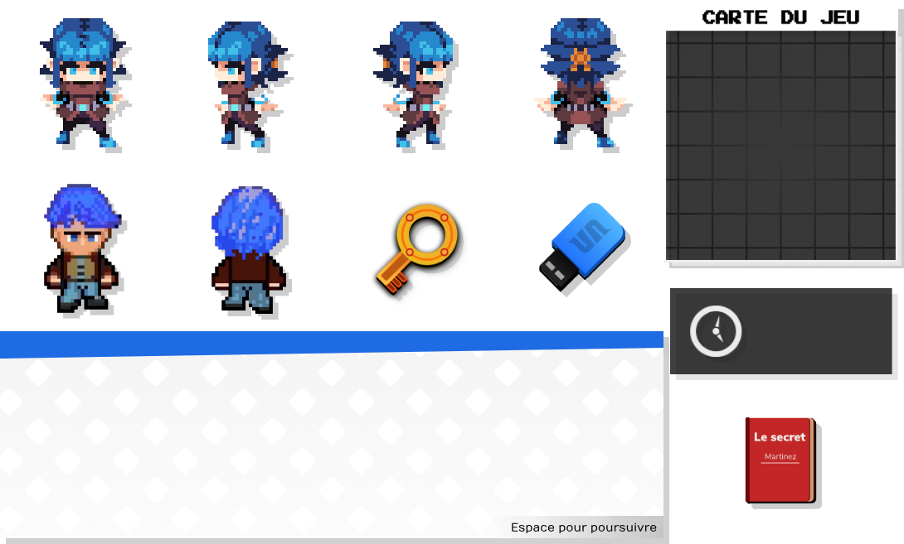
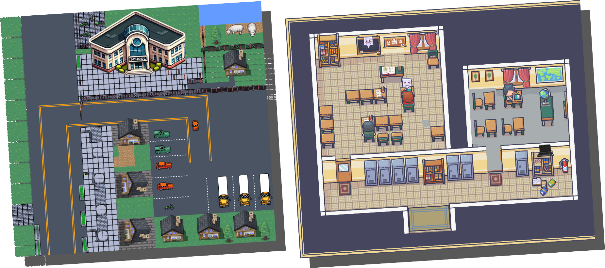

Code Breakers est un mini jeu vidéo en top-down que j'ai conçu dans le cadre d'un projet scolaire en classe de Terminale, en l'espace de quelques semaines. Ce projet m'a permis d'apprendre la Programmation Orientée Objet (POO) et d'approfondir au sens large mes connaissances en Python.

Un mini jeu à la narration décalée et absurde, faisant la parodie du lycée où j'ai étudié, dont voici le synopsis : le joueur incarne un étudiant du lycée Marguerite URsenar, où le port du jogging est interdit (une véritable cause dans mon lycée dont j'ai souhaité faire la référence de façon humoristique). Le proviseur, Martinez, a promis de lever cette restriction si quelqu'un parvient à trouver son livre secret. Avec l'aide de Yassin, virtuose du clavier et expert en matière de hacking, le lycéen est chargé de retrouver ce livre pour la cause de ses camarades !

Ce projet a été pour moi l'occasion de mêler créativité, narration et code. Il a fallu faire preuve d'innovation pour certains aspects tels que la gestion d'une mini carte, un système de dialogues, et une notion de caméra qui suit le joueur et positionne correctement les éléments selon l'emplacement de cette dernière. De façon autodidacte, j'ai également pu comprendre le fonctionnement de l'héritage en développement.

