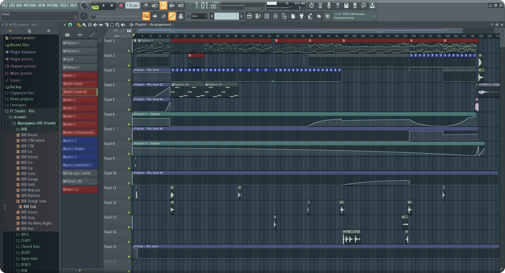

Depuis tout jeune, la musique ne me laisse pas insensible. Je n'écoute pas un genre en particulier, au contraire je trouve goût à tous les types de musiques.
J'ai toujours été admiratif des compositeurs chevronnés qui parviennent à trouver une mélodie entraînante, une combinaison harmonieuse. Je m'étais moi-même imaginé des combinaisons de notes qui me semblaient cohérentes, mais comme je ne savais ni jouer d'instrument ni utiliser un logiciel de MAO[^1], impossible de les retranscrire.

Un ami m'a fait découvrir cet univers, et cela a révélé l'une de mes passions actuelles !

Bien que je ne sois pas un expert dans la matière, on dit de moi que j'ai l'oreille musicale. J'adore concevoir des productions musicales sur FL Studio et les partager. En voici une sélection !

### Hashtag AD
<audio controls>
  <source src="/src/assets/music-project-hashtag-ad.mp3" type="audio/mpeg">
  Your browser does not support the audio tag.
</audio>

### Kuiper
<audio controls>
  <source src="/src/assets/music-project-kuiper.mp3" type="audio/mpeg">
  Your browser does not support the audio tag.
</audio>

### Nevada Reboot
<audio controls>
  <source src="/src/assets/music-project-nevada-reboot.mp3" type="audio/mpeg">
  Your browser does not support the audio tag.
</audio>

### Winter's Chimes
<audio controls>
  <source src="/src/assets/music-project-winters-chimes.mp3" type="audio/mpeg">
  Your browser does not support the audio tag.
</audio>

### light years away.
<audio controls>
  <source src="/src/assets/music-project-light-years-away.mp3" type="audio/mpeg">
  Your browser does not support the audio tag.
</audio>

[^1]: *MAO = Musique assistée par ordinateur*